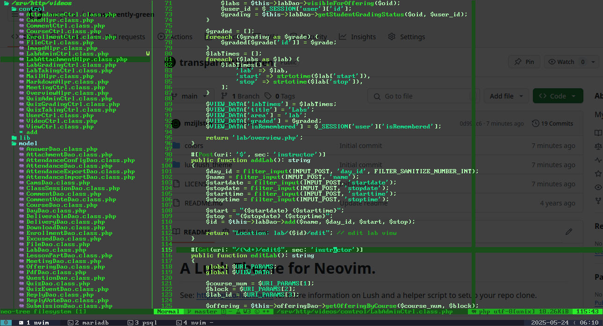

A Lush Theme for Neovim.
===

A mix of nostaligcal and modern design. Colors are all shades of green on a transparent background. 

While this theme is designed to be used with a transparent background, it will of course also work with a solid background.

See: http://git.io/lush.nvim for more information on Lush and a helper script
to setup your repo clone.
